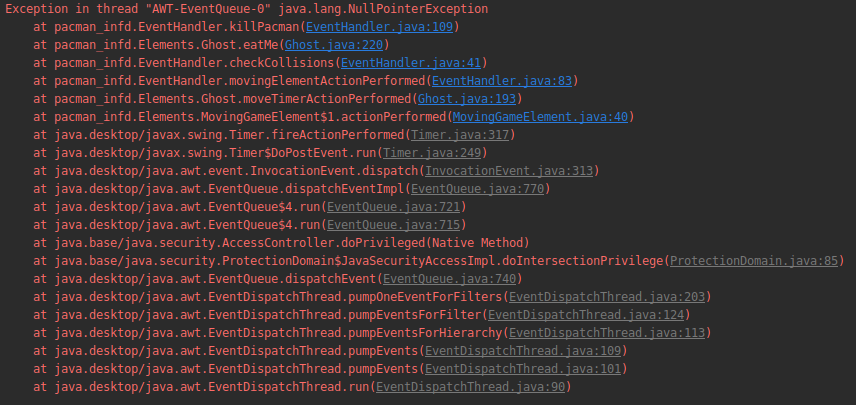

Pacman_INF-D
============

Project Pacman INF-D

## Information for this project

The project is created with the Netbeans IDE and build with ANT

## Requirements 

- Maven

- JUnit5

## Todo

- [ ] Pacman doesn't correctly react when we want to change its direction.
- [ ] The orientation of Pacman doesn't change when Pacman change the direction.
- [ ] Welcome Page is a white page, it must be better if we have a picture of Pacman 
    to render the game more attractive.
- [ ] Exceptions aren't catch like this : 
    
    
    
- [ ] Create more unit tests.
- [ ] (See if it's possible) the movements of Pacman it's not fluid.
- [x] Ant to Maven
	- https://github.com/SERG-Delft/jpacman-framework/blob/master/pom.xml
	- https://www.javaworld.com/article/2072203/an-introduction-to-maven-2.html
- [ ] All unit tests in TestPathFinder.java fail, see why to find a solution.
- [ ] Convert all tests in JUnit 4 to JUnit 5
